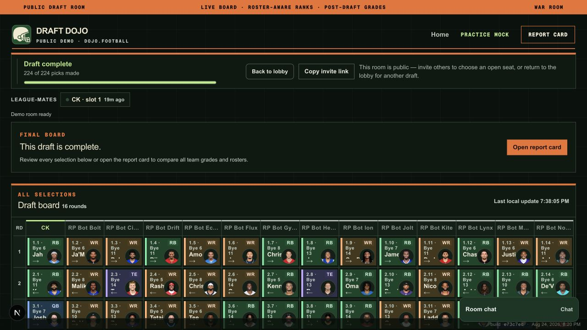
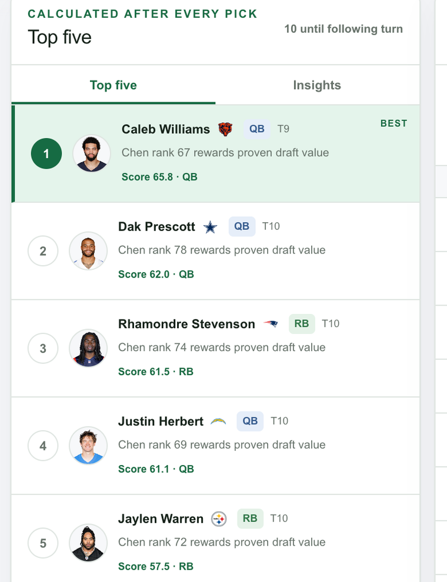
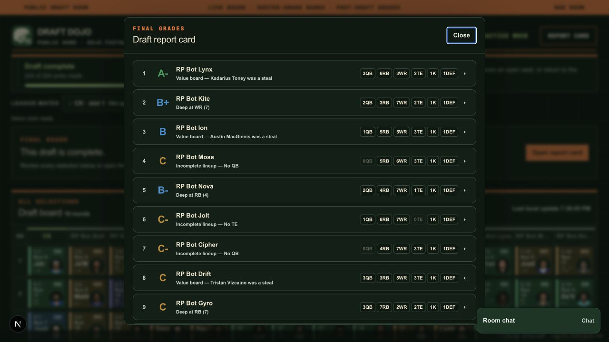

<div align="center">

# Draft Dojo

**An open-source fantasy football draft room that recalculates your top five after every pick.**

- Live app: **[dojo.football](https://dojo.football)**
- No-signup multiplayer demo: **[dojo.football/demo](https://dojo.football/demo)**
- Source: **[github.com/dconroy/dojo.football](https://github.com/dconroy/dojo.football)**
- License: **[MIT](LICENSE)**

Draft Dojo is a browser-based command center for **8–14 team snake drafts**. It follows
Sleeper or Yahoo, recalculates roster-aware recommendations after every pick, explains its
scoring, and grades the room when the draft ends. You still make the real selection in your
league app; Draft Dojo never submits a pick on your behalf.



</div>

> Using the app? Read **[USER.md](USER.md)**. Building on it? See **[ARCHITECTURE.md](ARCHITECTURE.md)**.

## Why it is open source

Draft recommendations should be inspectable. The ranking adapters, factor weights, roster
rules, mock opponents, synchronization logic, and report-card curve are all in this
repository. Fork it to run your own room, swap ranking sources, tune the recommendation
model, or open an issue when the math looks wrong.

The hosted site at [dojo.football](https://dojo.football) is the fastest way to try it.
The public demo needs no account: enter a team name, invite friends, claim seats, chat with
text or GIPHY GIFs, and let robots fill the rest of the room.

The rankings shown throughout this README are Boris Chen's public tiers loaded live and
cached; player names/headshots are real, but treat any specific board as a **demonstration**
rather than 2026 advice. The board defaults to Chen's **0.5 PPR** list and can switch to full
PPR or standard on the fly.

---

## Feature tour

### Recommendations after every pick

The left rail is the whole point. After **every** selection it recalculates the five best
players for *your* roster from Chen rank/tier, tier cliffs, position need & scarcity, roster
balance, turn distance, optional ADP, an estimated return-probability, and minor team/bye
concentration — each with a plain-English reason and a transparent score. "Why #1?" compares
the top pick against the next two.

<div align="center">

</div>

### Draft insights

Flip to the **Insights** tab for a roster read: red-flag checks, the model's lean, and your
bye-week concentration so you never stack four starters on the same week.

<div align="center">

</div>

### Draft report card

When the board fills up, every team gets **graded on a curve**. Your team is the hero panel —
letter grade, overall rank, and concrete good/bad reasons (elite anchors, positional depth,
lineup holes, bye logjams). Incomplete lineups cannot grade above **B+**. The leaderboard
ranks all twelve and expands to show each roster.

<div align="center">

</div>

### Two ways to run a draft

The admin starts a draft in one click. Practice mocks run the whole room on a timer;
draft night follows your real Yahoo draft.

| Mode | What happens | When to use it |
|---|---|---|
| **Practice mock** | Robots draft the open seats on a timer and **pause at every real manager's slot** until they confirm. Absent managers are auto-drafted a **complete** starting lineup after their clock expires. | A full group dress rehearsal |
| **Draft night — live** | The board follows your **real Yahoo draft** automatically and keeps recommendations fresh. | The actual draft |

Robots draft with **slight, seeded preferences** (a deterministic per-team nudge) so opponents
feel like managers with biases instead of identical best-available bots — while staying
reproducible so the shared board never reshuffles between syncs.

---

## What works

- **Public multiplayer demo** — named human teams, clearly labeled robots, invite links,
  30-second human clocks, room chat with GIPHY, and no signup.
- **Sleeper and Yahoo connections** — discover drafts/leagues and follow picks without
  automatic pick submission. Sleeper uses its public read API; Yahoo uses encrypted OAuth.
- **Weekly HQ for Sleeper and Yahoo** — board-aware roster, matchup, standings,
  injury, transaction, lineup, and waiver reads. Recommendations are advisory;
  lineup changes and claims always stay manual in the league app.
- **Multiple ranking sources** — Boris Chen, Sleeper ADP, and eligible FantasyPros ECR,
  with Standard, Half PPR, and Full PPR scoring.
- Pick any draft slot in an **8–14 team**, **10–16 round** snake draft; drafted players
  disappear and picks, roster slots, and the board update immediately.
- Five recommendations with factor-derived explanations, recalculated after every pick.
- Confirm a recommendation locally, mark any player drafted, undo the latest pick, pin
  targets, avoid players, search/filter by position & tier, and change key strategy weights.
- **Chen list toggle** — default 0.5 PPR, switch to PPR or standard; each format is fetched
  and cached independently and stays auto-updated.
- **Shared board** — everyone sees the same picks. Local storage preserves the active draft
  instantly; Prisma/Neon Postgres synchronizes the session across devices and managers.
- **Report card** grading with curved letter grades and per-team reasons.
- Export draft results as JSON or CSV. Light and dark themes. A light footer shows the
  release git hash and build time. Automatic pick submission is unavailable and disabled.

---

## Setup

Requires **Node.js 20.9+** (Node 22 LTS recommended).

```bash
npm install
cp .env.example .env
npm run db:generate
npm run db:migrate
npm run dev
```

Open <http://localhost:3000>. To use the included CSV fallback, import
`public/data/sample-chen-ppr.csv`.

Tests and checks:

```bash
npm test          # unit tests (vitest)
npm run lint      # eslint
npm run build     # production build
npx playwright install chromium
npm run test:e2e  # browser tests
```

---

## Ranking data

`src/adapters/chen/boris-chen.ts` is the replaceable source adapter. It preserves tier,
position-specific rank, overall rank, team, bye, and optional ADP from supported CSV columns.
The fetch route uses the public URLs configured by `CHEN_HALF_PPR_CSV_URL` (default),
`CHEN_PPR_CSV_URL`, and `CHEN_STANDARD_CSV_URL`, stores only successful responses in Postgres,
and falls back to the last successful cache. It does not scrape pages, bypass access controls,
or work around source restrictions.

Because source availability and schema can change, manual CSV import remains the safe fallback.
Confirm that your use of any third-party data complies with its terms.

## Recommendation model

Weights live in `src/config/strategy.ts`. Each signal is normalized, multiplied by its
configured weight, and retained in the result as a factor breakdown. Early kicker/defense and
unnecessary backup QB/TE penalties are explicit. The last pick (and the turn before it when
two starter holes remain) favors completing K/DEF over a vanity backup. **The model uses no LLM-generated ranking or
explanation** — every number and reason is derived from the transparent factor engine. The UI
exposes the most important live adjustments; edit the configuration file for all defaults.

## Yahoo developer app and OAuth

1. Create an application at <https://developer.yahoo.com/apps/>.
2. Request **OpenID Connect** permissions — **Profile only, not Email**. `YAHOO_OAUTH_SCOPE`
   defaults to `openid profile`.
3. Set the callback URL to `https://dojo.football/api/yahoo/callback` (add a second redirect
   URI for any preview/canary host, matching that host exactly).
4. Copy only the client ID and secret into your uncommitted `.env`; never add access or
   refresh tokens to Git.
5. For **live draft sync**, separately request Fantasy Sports API access at
   <https://sports.yahoo.com/developer/access/>. Yahoo may return `403` until it approves.
6. `YAHOO_LEAGUE_KEY` is **optional** — leave it unset. The app resolves the league from the
   armed draft, the connected board, or auto-discovery.

The adapter supports settings, teams, draft results, and available players. `/api/yahoo/auth`
starts OAuth; access and refresh tokens are encrypted with AES-256-GCM before storage in
Postgres. See `docs/YAHOO_LIMITATIONS.md`.

## Sleeper

Sleeper needs **no setup** — no developer app, no OAuth, no API key, no env var. It uses the
public `api.sleeper.app` read API. Users connect on `/login` by entering their Sleeper
username; the app lists their current-season leagues/drafts and follows the picks. It never
submits a pick in Sleeper. Weekly HQ also uses only public reads. It derives free agents by
subtracting every roster from the cached Sleeper NFL player list, and uses public trending
adds as one explainable waiver-ranking signal; it never changes a lineup or submits a claim.

## Experts (ranking sources)

The **Expert** dropdown offers three sources; **Scoring** (0.5 PPR / PPR / standard) is
independent:

| Expert | Setup |
|---|---|
| **Boris Chen** | Default. Public CSVs, no key. |
| **Sleeper ADP** | Market ADP, no key. |
| **FantasyPros ECR** | Requires a paid **HOF** key (`API Access` is HOF-only, not MVP). Free/MVP keys return 10 players per position and cannot populate a complete board. Request a key at [secure.fantasypros.com/api-keys/request](https://secure.fantasypros.com/api-keys/request/), set `FANTASYPROS_API_KEY` in `.env` and Vercel, then redeploy. |

## Public demo

`/demo` is an anonymous draft lobby — no account. Enter a team name, join a listed public
room and choose an open seat, or create one with Standard/Half-PPR/PPR scoring, 8–14
rosters, 10–16 rounds, and your preferred slot. A new room provides a unique invite link
for friends; they enter their team name and choose any remaining seat. Robots fill empty
seats, idle humans auto-draft after about
30 seconds. Completed rooms are recycled after ~45 minutes, and unfinished rooms disappear
from the lobby after one hour without an active manager. “Back to lobby” leaves the shared
room intact instead of resetting everyone’s draft.

Demo rooms include a floating chat for seated managers; spectators can read it. Messages
expire after one hour. Set `GIPHY_API_KEY` locally and in Vercel to enable unrestricted GIF
search through the GIPHY API. The key stays server-side, and the picker displays the required
“Powered by GIPHY” attribution.

## Project layout

See **[ARCHITECTURE.md](ARCHITECTURE.md)**. Prisma stores shared sessions, encrypted OAuth
credentials, sync checkpoints, and confirmed identity mappings in Postgres. Yahoo player IDs
become canonical only after the identity resolver returns an exact result or a user confirms
an ambiguous mapping.

## Before trusting it in a live draft

- Replace synthetic fixtures with validated 2026 Chen data and review unmatched identities.
- Complete player-response parsing and UI reconciliation using a real 2026 test league after
  Yahoo approves API access.
- Measure how quickly Yahoo publishes active draft results and tune conservative polling/backoff.
- Run a full dress rehearsal, including stale sync, conflicts, undo, refresh, and loss of network.
- Expand browser tests against production-sized rankings.

> Yahoo has no documented live-draft pick submission operation. **Confirm Pick is local only.**
> Do not reinterpret transaction or lineup endpoints as draft APIs.
